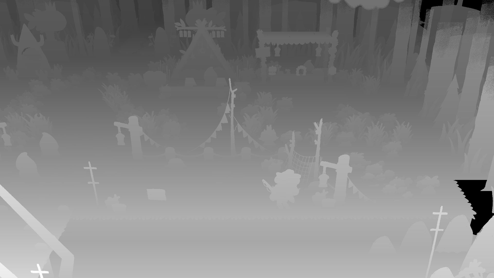
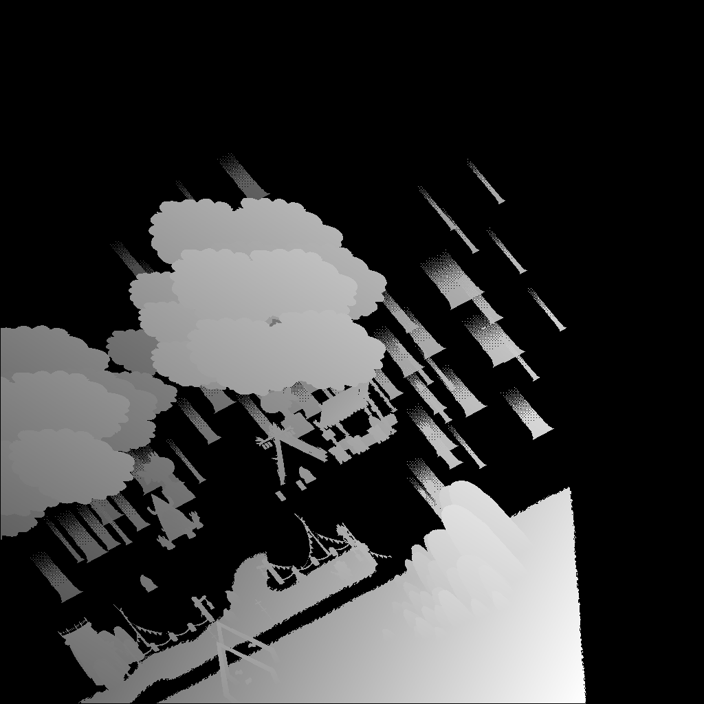
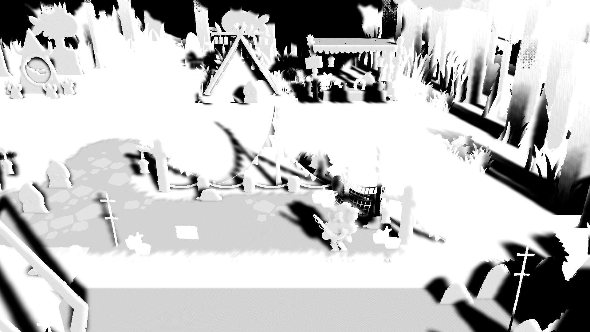
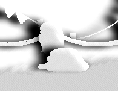

# Rendering pipeline analysis

::: info
🧹 Stub
:::

- The [Universal Rendering Pipeline (URP)](https://docs.unity3d.com/6000.2/Documentation/Manual/urp/urp-introduction.html) is used, likely with modifications for the game.
- The game is forward rendered and most sprites are opaque (alpha clipped) so they can write to the depth buffer accurately.
- [Spine2D](https://esotericsoftware.com/) is used for most animated sprites like characters.

## Steps of rendering a frame

By utilizing a graphics debugger we can investigate the rendering steps of the game.

::: info
Some screenshots are flipped around the y axis for viewing purpose as Unity renders some scenes upside down.
:::

### 1 - Depth only prepass

Firstly the game prepares performs a depth only prepass. We'll see shortly what the resulting depth buffer is used for.

(In this scene the depth values range from 0 to 0.0014)

### 2 - Directional shadow map

Secondly the game prepares a shadow map from the perspective of the sun.

Notably objects like the floor are omitted here.

### 3 - Screen space shadows

The game appears to utilize Unitys URP Screen space shadows feature which works by combining a depth prepass and the shadow map into a screenspace lighting mask.

It is possible that the shader used to generate this mask is modified as it also appears to generate a soft rim light as can be seen on the sun-facing sides of these rocks.

### 4 - Opaque Pass

Next we arrive at the most important render pass in the pipeline. Here all opaques are rendered, including the environment, props and characters.

Notably the depth prepass is not used here, instead the depth buffer is cleared and populated again from scratch. (Though a rendering trick related to the floor also requires this)

Some objects here are manually sorted to render before other objects.

::: info
TOOD: FInish this!
:::